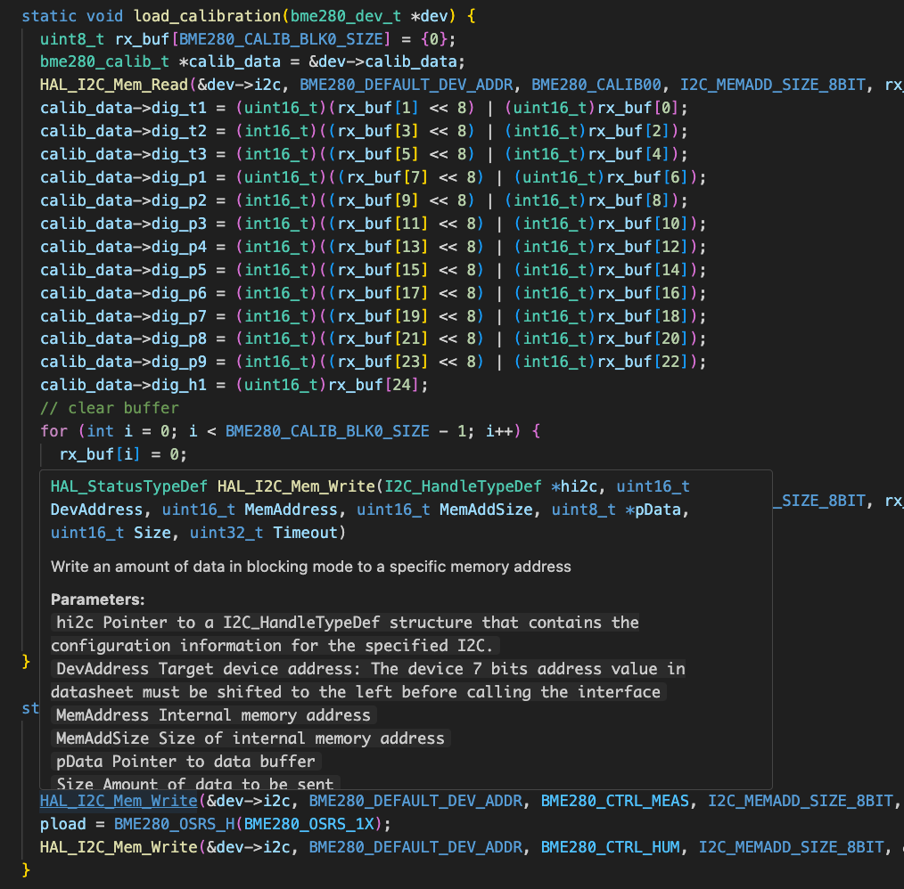
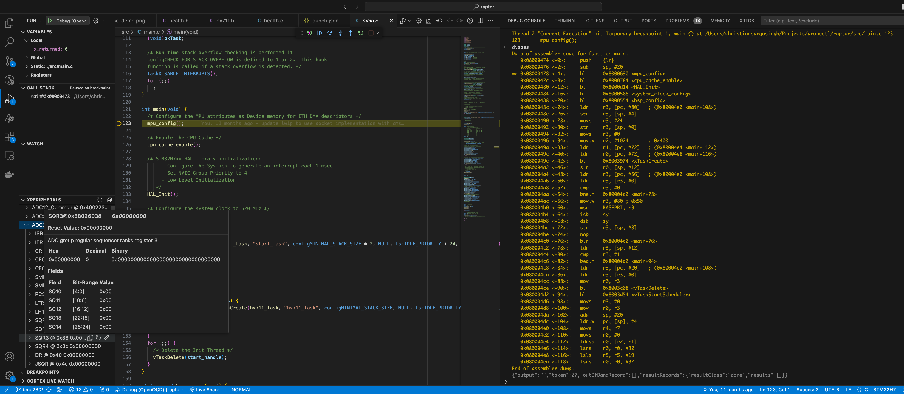
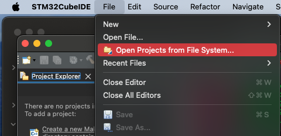
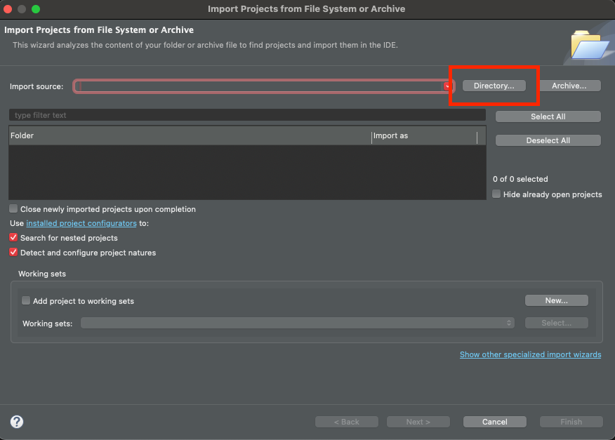
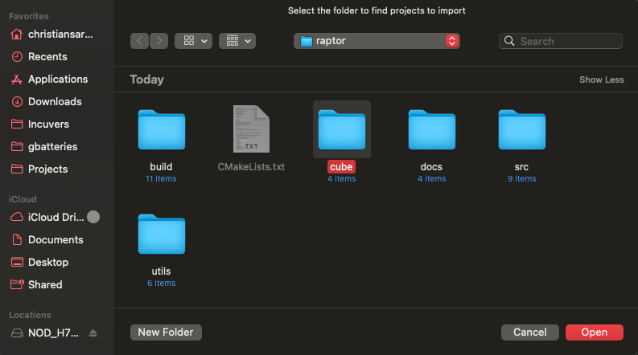
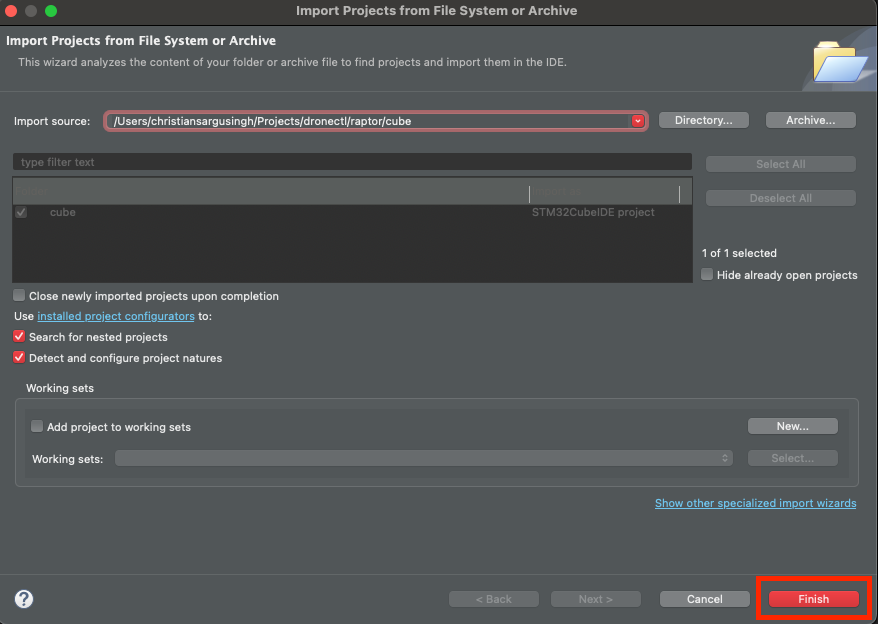
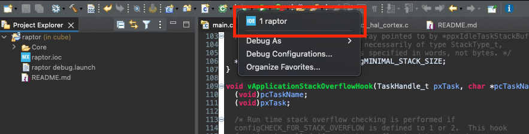
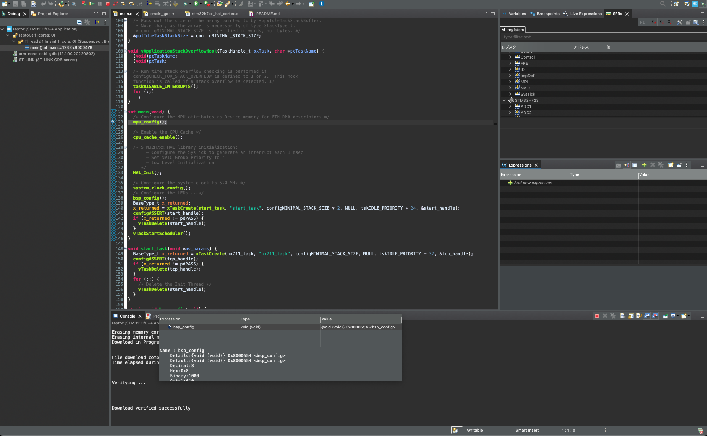

# Firmware Developers Guide - Getting Started

Modified: 2024-01

This document will provide the resources developers need to get started working on the firmware for this project. We control our software versions tightly to reduce developer entropy. Please reference our required software documentation [here](https://www.notion.so/kolapo/Required-Software-1a9d1be387aa4bab9edf3ddc469ea800?pvs=4) for the correct software versions. For each section it is implied that you install the version referenced in this document.

## Navigation
1. [Toolchain Installation](#toolchain-installation)
2. [OpenOCD Installation](#openocd-installation)
3. [CMake Installation](#cmake-installation)
4. [VSCode Setup](#vscode-setup)
5. [Compiling the Firmware](#compiling-the-firmware)
6. [Debugging](#debugging)
7. [Flashing the Firmware](#flashing-the-firmware)
8. [Issues](#issues)


## Toolchain Installation
We first need to install the ARM toolchain on our local development machine. Note that these downloads are large and may take some time.

> Note for Windows Installations - The binary files included as part of these software installations should be included as part of your system path. If the installer has the option, be sure to enable system path discovery.

### MacOSX
Get the CMSIS `arm-none-eabi-gcc` toolchain for ARM Cortex microcontrollers:
```bash
brew install --cask gcc-arm-embedded
```
### Windows
Download the required version from the windows install link [here](https://developer.arm.com/downloads/-/gnu-rm)

## OpenOCD Installation

### MacOSX
Get `openocd` using `brew`. Be sure to specify the required version:
```bash
brew install open-ocd@0.11.0
```

### Windows
Download xPack OpenOCD from the github release link [here](https://github.com/xpack-dev-tools/openocd-xpack/releases)

## CMake Installation
This project is built using CMake as the backend.

### MacOSX
Install `cmake` using `brew`. Be sure to specify the required version:
```bash
brew install cmake@3.39.0
```

### Windows
Download the required version from the windows install link [here](https://cmake.org/download/)

## VSCode Setup

> If you prefer not to use VSCode for editing or debugging you can skip this section. 

In order to setup VSCode for development with STM32 microcontrollers, it is recommended you install the following extensions:
1. `ms-vscode.cpptools` - C/C++ intellisense support
2. `marus25.cortex-debug` - STM32 Debugger Support
3. `twxs.cmake` - Provides CMake language intellisense

Create a `.vscode` folder in the repository root and copy the files in the [vscode](/utils/vscode) directory into it. The files included provide the following capability:
1. `c_cpp_properties.json` -> configuration for C/C++ intellisense and static analysis tools.
2. `launch.json` -> plugin for vscode debugging interface powered by `cortex-debug`

Because the `c_cpp_properties.json` requires a compile commands file to be generated, you will need to **build the firmware** in order to realize these features. This is because intellisense is configured to look for a `compile_commands.json` file in the `build` directory to know how to find all the include headers and source files. When the firmware is built successfully a `compile_commands.json` file will be present and you will be able to use intellisense features.

## Compiling the Firmware
Clone this repository and navigate to the repository root:
```bash
git clone git@github.com:dronectl/raptor.git
cd raptor
```
Initialize the build system using `cmake`. For development we should set the `CMAKE_BUILD_TYPE` to `DEBUG`:

> Compile commands will be automatically generated by cmake which will be read by VSCode via the `c_cpp_properties.json` configuration.

```bash
mkdir build
cd build
cmake .. -DCMAKE_BUILD_TYPE=DEBUG
...
```
Compile the firmware:
> Hint: speed up build times by specifying `-j` (jobs) to enable multicore builds. Passing `-j` with no job limit will allow any number of simultaneous jobs to run.

```bash
make -j
...
```
Once complete the binary should be built as `raptor.elf` in the `build` directory. You should also have a `compile_commands.json` file which will now enable intellisense features (for VSCode users). If everything is done correctly there should be no red underline or default colored function names or variables indicating an unknown symbol. Below is an example of properly configured intellisense:



## Flashing the Firmware
The flash step is powered by OpenOCD. 

> OpenOCD will retrieve the binary from `build/raptor.elf` and program the MCU using [this](/utils/stm32h723.cfg) configuration spec.

Plugin the evaluation board to your PC over mini USB and flash the microcontroller using the `flash` directive:
```bash
make flash
```

## Debugging
This section will cover the steps to debug firmware using either VSCode powered by `cortex-debug` or STM32CubeIDE. Depending on the debugging job, one or both of these tools may be used. It is important that all developers are familiar with STM32CubeIDE at minimum since it is the most feature rich debugging platform.

> You must build the project with `-DCMAKE_BUILD_TYPE=DEBUG` to enable debug symbols.

### VSCode
Once the project binary is built, we can launch the vscode debugger using the `F5` key. Under the hood VSCode references the `launch.json` configuration file to use OpenOCD to flash the firmware and open a GDB server. To setup this configuration be sure to follow the steps in the [VSCode Setup](#vscode-setup) Here is a sample view of the debugger view:



Below is a list of capabilities provided by the `cortex-debug` extension:
 - Cortex peripheral register read and set
 - Variable inspection and watchpoints
 - Live breakpoints
 - Task seperated call stacks
 - Task runtime statistics
 - MCU memory inspection

### STM32CubeIDE
STM32CubeIDE is the most feature-rich debugging platform so for extensive debugging tasks it may be the preferred option. For example, some of the Serial Wire View features are not currently supported by the `cortex-debug` VSCode extention.

We can follow these steps to debug the firmware in CubeIDE. Note that these steps are performed on MacOS but the same steps can be followed on any platform:

1. Open CubeIDE (launch folder does not matter)
2. Open a new project from file system:



3. Select an external directory



4. Select the `cube` folder in the repository root:



5. Select Finish



6. Select the predefined `raptor` debug configuration



7. Verify the debugger works and matches as shown



Under the hood the `raptor` debug configuration points to the firmware binary from `build/raptor.elf` and uses the source references defined by the Cube project configuration settings.

## Issues
If there are any issues with this documentation please contact me at christian911@sympatico.ca or create a new issue.
